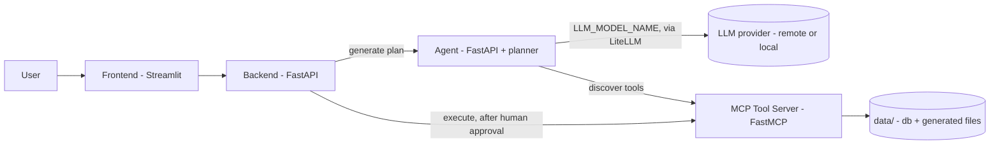
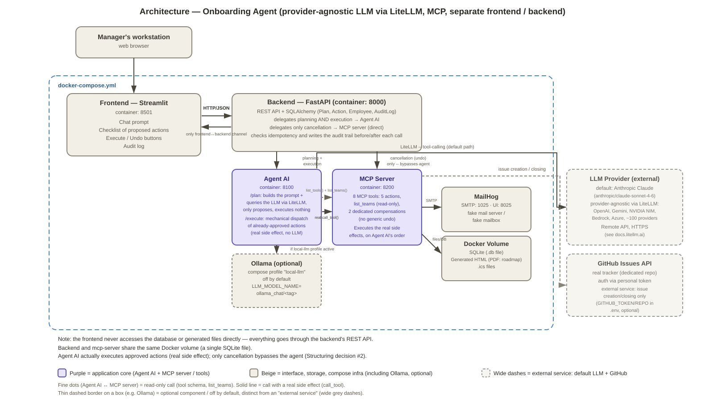

# Holberton Onboarding Agent - AI-assisted employee onboarding with human-approved action plans

## Summary

Holberton Onboarding Agent turns a short natural-language description of a new hire's arrival (e.g. *"Prépare l'arrivée de Nadia, développeuse dans l'équipe Frontend, qui commence le 1er septembre"*) into a concrete, reviewable action plan — creating the employee record, sending a welcome message, opening an onboarding ticket, generating a welcome document, scheduling an introduction meeting — and only executes what a human explicitly approves. Which actions to propose is decided by an LLM calling a set of onboarding tools exposed through an MCP (Model Context Protocol) server; the model never has direct write access to any system. Which model actually plans the actions is fully agnostic (`LLM_MODEL_NAME`, see [LLM Provider: any provider, any model](#llm-provider-any-provider-any-model)): any provider/model [LiteLLM](https://docs.litellm.ai) supports can be plugged in by changing a single `.env` value — a remote, hosted model (Anthropic's Claude API by default) or a local, self-hosted model via [Ollama](https://ollama.com/) for offline use or testing without an API key, with no code change required either way. The project was built for a Holberton hackathon to explore practical, human-in-the-loop AI automation, and should be considered a functional prototype / MVP, not a production-hardened system.

<details>
<summary><b>Table of Contents (Click to expand)</b></summary>

- [Summary](#summary)
- [How to install and run](#how-to-install-and-run)
  - [Prerequisites](#prerequisites)
  - [Configuring and running](#configuring-and-running)
    - [Installing Docker on your OS](#installing-docker-on-your-os)
      - [Windows 10](#windows-10)
      - [Windows Subsystem for Linux (WSL / WSL 2)](#windows-subsystem-for-linux-wsl--wsl-2)
      - [Debian-based Linux (Ubuntu, Debian, Mint)](#debian-based-linux-ubuntu-debian-mint)
      - [Arch-based Linux (Arch Linux, Manjaro)](#arch-based-linux-arch-linux-manjaro)
    - [Step 0: Retrieving project files](#step-0-retrieving-project-files)
    - [Step 1: Environment Configuration (one-shot)](#step-1-environment-configuration-one-shot)
      - [WARNING about CRITICAL CONFIGURATION VALUES](#warning-about-critical-configuration-values)
    - [Step 2: Manually managing the application (repeatable)](#step-2-manually-managing-the-application-repeatable)
      - [Starting](#starting)
        - [Automatically](#automatically)
        - [Manually (for finer control)](#manually-for-finer-control)
      - [Monitoring](#monitoring)
      - [Stopping](#stopping)
      - [Deleting all information (containers AND database)](#deleting-all-information-containers-and-database)
- [How to use](#how-to-use)
  - [Starting / stopping program](#starting--stopping-program)
  - [Usage overview](#usage-overview)
- [Features and limitations](#features-and-limitations)
  - [Supported (v1.0)](#supported-v10)
    - [Human-in-the-loop action planning](#human-in-the-loop-action-planning)
    - [AI Assistant & Model Context Protocol (MCP) Integration](#ai-assistant--model-context-protocol-mcp-integration)
    - [LLM Provider: any provider, any model](#llm-provider-any-provider-any-model)
    - [Containerized Architecture & Portability](#containerized-architecture--portability)
  - [Not Supported (yet) & Known Limitations](#not-supported-yet--known-limitations)
    - [AI Assistant & MCP Integration](#ai-assistant--mcp-integration)
    - [Architecture & Reliability](#architecture--reliability)
    - [Security & Production Readiness](#security--production-readiness)
    - [Testing & Code Coverage](#testing--code-coverage)
- [Examples of use](#examples-of-use)
  - [Valid examples](#valid-examples)
    - [Getting information on a specific product (per id or sku) in various languages](#getting-information-on-a-specific-product-per-id-or-sku-in-various-languages)
    - [Questions about stocks for a product or a branch](#questions-about-stocks-for-a-product-or-a-branch)
    - [Mixed questions](#mixed-questions)
  - [Failing examples](#failing-examples)
- [Technical information](#technical-information)
  - [General architecture](#general-architecture)
    - [Core design principles](#core-design-principles)
    - [Main code structuration](#main-code-structuration)
  - [Technical stack overview](#technical-stack-overview)
  - [Communications overview](#communications-overview)
  - [Process Flow for a request from end-user](#process-flow-for-a-request-from-end-user)
    - [Backoffice...](#backoffice)
    - [Frontoffice](#frontoffice)
  - [Architecture macro diagram](#architecture-macro-diagram)
  - [Memory management & Performance](#memory-management--performance)
- [Testing](#testing)
- [Project constraints and methodology](#project-constraints-and-methodology)
  - [Imposed constraints](#imposed-constraints)
    - [Requirements](#requirements)
  - [Project methodology](#project-methodology)
  - [Acknowledgments](#acknowledgments)
- [Technologies Used](#technologies-used)
- [Authors](#authors)
- [License](#license)

</details>

## How to install and run

<details>
<summary>(Click for detailed information on prerequisites, download and installation/configuration/run steps)</b></summary>

### Prerequisites

To run the Holberton Onboarding Agent stack, **Docker** and **Docker Compose** are the only core system requirements. Because all services (backend API, planning agent, MCP tool server, Ollama, and the Streamlit frontend) are fully containerized, you do not need to install Python or any other runtime locally on your host system.

Note however that if you want to run our test suite locally or just want to run components without the whole Docker abstraction you'll need Python3 installed (you can refer to this [third-party tutorial](https://realpython.com/installing-python/)) along with all the libraries listed in the individual requirements (to have a list quickly, from a shell like Bash opened in project root you can run `find . -type f -name "requirements.txt" -exec cat {} + | tr -d '\r' | grep -v '^#' | sort -u`). Then just install them with pip.

#### Additional Requirements:
- **Git**: To clone the project repository.
- **Modern Web Browser**: Chrome, Firefox, Edge, or Safari to access the Streamlit frontend and the backend/agent API docs.


#### Installing Docker on your OS

##### Windows 10
1. Download and install **[Docker Desktop for Windows](https://docs.docker.com/desktop/setup/install/windows-install/)**.
2. During installation, make sure the **Use WSL 2 instead of Hyper-V** option is checked.
3. Restart your computer after installation completes.

##### Windows Subsystem for Linux (WSL / WSL 2)
1. Install Docker Desktop on Windows (as described above).
2. Open Docker Desktop, navigate to **Settings > Resources > WSL Integration**.
3. Toggle the switch to enable integration for your installed Linux distribution (e.g., Ubuntu).
4. Open your WSL terminal; `docker` and `docker compose` will now be available directly.

##### Debian-based Linux (Ubuntu, Debian, Mint)
Run the following commands in your terminal:
```bash
sudo apt update
sudo apt install -y docker.io docker-compose-v2
sudo systemctl enable --now docker
sudo usermod -aG docker $USER
# Note: Log out and log back in for the group membership change to take effect.
```

##### Arch-based Linux (Arch Linux, Manjaro)
```
sudo pacman -Syu docker docker-compose
sudo systemctl enable --now docker
sudo usermod -aG docker $USER
# Note: Log out and log back in for the group membership change to take effect.
```

### Configuring and running

The Holberton Onboarding Agent uses Docker Compose to orchestrate all microservices. Configuration is driven entirely through environment variables defined in a `.env` file at the root of the repository.

#### Step 0: Retrieving project files

If you have Git it is very quick and easy: open a shell like Bash where you want project to sit then type those commands.
```
git clone https://github.com/llacote-holberton/holberton-onboard-agent.git
cd holberton-onboard-agent
```

Alternatively you can just download the [latest release zip](https://github.com/llacote-holberton/holberton-onboard-agent/archive/refs/heads/main.zip) and extract it in your favorite file explorer then open the holberton-onboard-agent folder.


#### Step 1: Environment Configuration (one-shot)

Copy the provided `.env.example` file to create your local `.env` configuration:

```bash
cp .env.example .env
# If you want to edit in command line with vim
vim .env
```
Open with your favorite GUI text editor and adjusted the required values.

##### WARNING about CRITICAL CONFIGURATION VALUES
Before launching the stack, you must review/update the following placeholder values in your .env file:
- ALLOWED_TOOLS: comma-separated list of onboarding actions the agent is allowed to actually execute. Any proposed action whose tool isn't listed here is still shown to the user, but struck through and excluded from execution. Available tools: `create_employee_record`, `send_welcome_message`, `create_onboarding_issue`, `generate_handbook`, `create_calendar_event`. Write the exact tool names you want enabled, separated by a single comma (e.g. `ALLOWED_TOOLS=create_employee_record,send_welcome_message`). **Leaving it empty (the shipped default) means every tool is allowed — this is the most permissive setting, not the safest one**: with the default `.env`, all 5 tools execute on approval, including sending real e-mails through MailHog. Set it explicitly if you want to restrict what the agent can actually execute.
- GITHUB_TOKEN & GITHUB_REPO: **only required if you want to use the "create_onboarding_issue" tool** (i.e. if you include it in `ALLOWED_TOOLS` above, or just want the model to be able to propose it) — checked lazily, only when that tool actually runs, so the rest of the stack starts and works fine without them. Leave the placeholder as-is if you don't need GitHub ticket creation. (NOTE: for now only GitHub is supported.)
- LLM_MODEL_NAME: which model plans the actions, `<provider>/<model>` (default `anthropic/claude-sonnet-4-6`) — see [LLM Provider: any provider, any model](#llm-provider-any-provider-any-model) below for the full picture and every supported format.
  - If the provider is remote (e.g. `anthropic/...`, `openai/...`): **LLM_MODEL_API_KEY** is required — see the dedicated section below for where to get one. Without it the agent fails fast with an explicit error on the first plan request, it never silently falls back to a different model.
  - If the provider is `ollama_chat/...` (local — **use this prefix, not `ollama/`**, see the note in [LLM Provider: any provider, any model](#llm-provider-any-provider-any-model) below): no API key needed, but see [Memory management & Performance](#memory-management--performance) before picking a tag — `./start.sh` (recommended, see [Starting](#starting)) detects this case automatically and handles the extra Compose profile + model download for you, no manual steps required.

Every other value in `.env.example` (ports, `LLM_CALL_TIMEOUT_SECONDS`, `MAX_TURNS`, MailHog settings, `DATA_DIR`/`DATA_HOST_DIR`, etc.) already ships with a sensible default — nothing else needs to be touched for a first run. See the comments in `.env.example` itself if you want to tune any of them later.

# Step 2: Manually managing the application (repeatable)

NOTE: all the following commands expect you to run them from the project's root so the 'compose' command automatically finds the related docker-compose.yml file.
Otherwise you will need to specify the path to the compose file.

## Starting

**IMPORTANT** Please ensure you have an active internet connection at least for the first time you run the app, and expect some downloads of data of between 2go to 10Go depending on your chosen configuration (especially for the local LLM model).

### Automatically

The recommended way to start the stack is `./start.sh` from the project root. It reads `LLM_MODEL_NAME` from `.env` and does the right thing whichever provider you configured: a plain `docker compose up -d --build` if it's a remote provider (e.g. `anthropic/...`), or the same command plus the two extra steps a local Ollama model needs (Compose profile + one-time model pull, waiting for the container to be ready first) if `LLM_MODEL_NAME` starts with `ollama_chat/` or `ollama/` — see [LLM Provider: any provider, any model](#llm-provider-any-provider-any-model) below for what those extra steps are, in case you want to understand or reproduce them manually. `chmod +x start.sh` once if needed, then just run `./start.sh` every time you start the stack.

### Manually (for finer control)
To build all container images and start all microservices yourself, run:
`docker compose up -d --build` 
The `-d` option lets you keep hand on your terminal.
The `--build` one forces Docker to recreate images.

By default (a remote `LLM_MODEL_NAME`, e.g. `anthropic/...`) this is all you need — plan generation calls the remote API directly, no extra local model service involved. **If `LLM_MODEL_NAME` starts with `ollama_chat/` or `ollama/` instead**, the command above is *not* enough by itself: the `ollama` service sits behind a Compose profile and isn't started this way, and the model tag needs a manual one-time download — see [LLM Provider: any provider, any model](#llm-provider-any-provider-any-model) below for the extra flag and the model-pull step (`./start.sh` above does both of these for you automatically, which is why it's the recommended path).

**IMPORTANT** as this project uses community-provided base images (e.g. Ollama, when enabled) alongside its own services built from source, a working network connection allowing access to internet is required whenever you use the option --build (a decent bandwidth, e.g. >=1.5Mo/sec, is recommended).

What does it do?
- docker: name of the "containarization tool" which allows you to create and run apps and operating systems in a total isolation.
- compose: one of the first level commands of docker: instructs it to find file(s) with specific name(s) in current filetree and parse them to get a series of instructions to create several "containers" lumped together. Here it will automatically target the "docker-compose.yml"
- '--build': forces the composition process to double-check the files which define how each container should be created, and (re)create them if need be.
- '-d': means "detached mode", aka the compose process will tell you about what it is doing on the terminal while working but when finished will "give terminal back to you". Without this option, the terminal would be "locked" to show runtime information. Which is a mode usually kept for debugging.

## Monitoring

You can check the status of all running containers at any time with:
`docker compose ps` (ps standing for "process status")
You can also check the logs of the containers by doing the following command, with or without a service name as parameter.
`docker compose logs <optional:name-of-service-as-defined-in-compose-file>`

Finally, you can monitor the live real-time memory and CPU consumption of all running containers across the stack by executing:
```
docker compose stats
```
Or just a snapshot of it at given time with `--no-stream` option added (`docker stats --no-stream`).


## Stopping

To stop the stack without losing any information, just run this: `./stop.sh` (this technically runs `docker compose down` under the hood with all pertinent options).

## Deleting all information (containers AND volume AND business data)

If you want to completely and cleanly uninstall this project (or just restart it from scratch), the recommended one-liner is:

- `./stop.sh --purge`

Under the hood this does two things:
-  `docker compose down -v` targeting all services (the `-v` option means "Volume deletion" and implies that the persistent storage for local models will be deleted from your machine).
- removes the contents of the business data directory (`DATA_HOST_DIR` in `.env`, `./data` by default) — this deletes the database file (`onboarding.db`) as well as any files (documents, calendar events...) you could have generated using the app. `docker compose down -v` alone does NOT do this, since `./data` is a bind-mounted host directory, not a Docker volume.

If you'd rather do it manually (or understand exactly what gets removed), the two equivalent steps are `docker compose down -v` and `rm -rf ./data/*`, run from project root.

</details>


## How to use

### Starting / stopping program

Once configured (see [Step 1](#step-1-environment-configuration-one-shot)), start the whole stack with `./start.sh` and stop it with `./stop.sh` — see [Starting](#starting) / [Stopping](#stopping) above for details and options.

Exact host ports for each service are defined in `docker-compose.yml` (and overridable via `.env`); the Streamlit frontend is the main entry point for end users, while the backend and agent expose their own interactive API docs (Swagger UI) for direct/manual testing.

### Usage overview

The typical flow is: (1) describe an arrival situation in French, in the frontend, in one message (e.g. *"Envoie un mail pour l'arrivée de Joël dans l'équipe dev Backend"*); (2) the agent turns that prompt into a proposed action plan, one action at a time, by calling the relevant onboarding tools on the MCP server — it does not guess team names or other structured data it isn't sure about, it validates them deterministically instead of trusting the model's own judgment; (3) the proposed plan is displayed for review — any action whose tool isn't in `ALLOWED_TOOLS` is shown struck through, with a note explaining why; (4) once you approve the plan, the backend executes only the retained (non-excluded) actions and reports the result of each.

No action is ever executed without this explicit human approval step.

<details><summary>Client UI sneak peek</summary>
<p align="center">
  
</p>
</details>

FIXME: Optionally provide screenshots or other visual examples of the main user interface.

## Features and limitations

The current version is a functional prototype / MVP built for a Holberton hackathon: the core human-in-the-loop planning flow works end to end, but the project has not been hardened for production use (see [Not Supported (yet) & Known Limitations](#not-supported-yet--known-limitations) below).

### Supported (v1.0)

#### Human-in-the-loop action planning

Given a free-text prompt describing a new hire's arrival, the agent proposes a plan of onboarding actions and never executes anything without explicit human approval. Plans are built turn by turn: the model is nudged to consider one action at a time rather than asked to output everything at once, which measurably improves reliability with small local models. Tools outside the configured `ALLOWED_TOOLS` allow-list are still shown in the proposed plan, but struck through and excluded from execution, so the human reviewer always sees the full intended plan, not a silently filtered one.

#### AI Assistant & Model Context Protocol (MCP) Integration

Onboarding actions are implemented as MCP tools served by a dedicated FastMCP server (`create_employee_record`, `send_welcome_message`, `create_onboarding_issue`, `generate_handbook`, `create_calendar_event`), discovered dynamically by the agent and offered to the LLM as callable tools. Data that must be correct (such as team names) is validated deterministically in code after the plan is built, rather than relying on the model to look it up itself — see [AI Assistant & MCP Integration](#ai-assistant--mcp-integration) under limitations for why.

#### LLM Provider: any provider, any model

Which model actually plans the onboarding actions is fully agnostic — a single `.env` value, `LLM_MODEL_NAME` (see `.env.example`), in `<provider>/<model>` format. This is powered by [LiteLLM](https://docs.litellm.ai), which normalizes ~100 providers' APIs (Anthropic, OpenAI, Ollama, Gemini, Bedrock, Azure, Nvidia NIM, and many more — see the [full provider list](https://docs.litellm.ai/docs/providers)) behind one call, so switching provider or model is a one-line config change, never a code change:

- **`anthropic/claude-sonnet-4-6` (default)** — calls Anthropic's Claude API over HTTPS. Requires `LLM_MODEL_API_KEY` (see [comment te brancher / getting an API key](#step-1-environment-configuration-one-shot) above, get one at [console.anthropic.com](https://console.anthropic.com)). Noticeably more reliable at structured tool-calling in real conditions than small local models — this is why it's the default. Prompts and tool schemas leave your machine for Anthropic's API when this provider is active.
- **`ollama_chat/<tag>`** (e.g. `ollama_chat/qwen3:8b`) — calls a local, self-hosted model served through [Ollama](https://ollama.com/), fully offline, no API key needed, no data leaving your machine. **Use the `ollama_chat/` prefix, not `ollama/`**: LiteLLM routes `ollama/` to Ollama's plain-completion endpoint (`/api/generate`), and `ollama_chat/` to its chat endpoint (`/api/chat`) — the one that actually supports structured tool-calling, [confirmed in LiteLLM's own Ollama docs](https://docs.litellm.ai/docs/providers/ollama). Even with the right prefix, expect this path to be noticeably less reliable at tool-calling than a remote provider and to need a reasonably capable host — see [Memory management & Performance](#memory-management--performance) — and be aware of a known LiteLLM issue where qwen3's "thinking" output field could make tool_calls disappear entirely ([BerriAI/litellm#18922](https://github.com/BerriAI/litellm/issues/18922), reported fixed upstream — run `pip install --upgrade litellm` in `agent/` if you hit a plan that silently comes back empty on a local model).
- **Any other LiteLLM-supported provider** (e.g. `openai/gpt-4o-mini`, `gemini/...`, `nvidia_nim/...`) — same `LLM_MODEL_API_KEY` variable, automatically mapped by `agent/planner.py::_ensure_provider_api_key` onto whichever provider-specific variable LiteLLM actually expects (e.g. `OPENAI_API_KEY`) based on the prefix of `LLM_MODEL_NAME` — you never need to know or set that variable name yourself.

**Recommended: `./start.sh`** (see [Starting](#starting) above) detects automatically whether `LLM_MODEL_NAME` designates a local Ollama model and, if so, handles both extra steps below for you — for a remote provider, it's just a plain `docker compose up -d --build`, nothing else needed.

**Manual path — local model (Ollama) extra steps.** Because it's heavier than most people need by default, the `ollama` container is *not* started by a plain `docker compose up` — it sits behind the `local-llm` Compose profile. If `LLM_MODEL_NAME=ollama_chat/...` (or `ollama/...`), you need two extra things on top of the usual `docker compose up -d --build` (both automated by `./start.sh`):

1. **Start the stack with the profile enabled** — either pass it explicitly:
   ```bash
   docker compose --profile local-llm up -d --build
   ```
   or set it once in your `.env` so you don't have to repeat the flag every time:
   ```bash
   COMPOSE_PROFILES=local-llm
   ```
   (there's a commented-out line ready for this in `.env.example`), then run `docker compose up -d --build` as normal.

2. **Pull the model tag into the running Ollama container** (one-time, or whenever you change the tag) — this is a *separate* step from starting the container, Ollama doesn't do it automatically:
   ```bash
   docker compose exec -t "ollama" ollama pull "qwen3:8b"
   ```
   (replace `qwen3:8b` with whatever tag you set after `ollama/` in `LLM_MODEL_NAME`). This downloads the model weights into the `ollama_data` volume — expect this to take a while and use several GB of disk/bandwidth depending on the tag. Until this finishes, plan generation requests will fail.

If you skip step 2 (or `./start.sh` is still mid-download), the agent will be reachable but every `/plan` request will fail once it tries to reach Ollama for a model tag that was never pulled — check `docker compose logs agent` (see [Monitoring](#monitoring)) if that happens.

Switching provider at any time just means changing `LLM_MODEL_NAME` (and `LLM_MODEL_API_KEY` if needed) in `.env` and restarting the `agent` service (`docker compose up -d --build agent`, or just re-run `./start.sh`) — no need to stop or remove the `ollama` container if it's already running and you're switching away from it, it'll simply sit idle.

#### Containerized Architecture & Portability

All services (frontend, backend, agent, MCP server, plus Ollama when the local LLM provider is enabled) are fully containerized and orchestrated via Docker Compose, so the whole stack can be started, stopped, or wiped with a single command on any Docker-capable host.

### Not Supported (yet) & Known Limitations

#### AI Assistant & MCP Integration

The application is designed for French-language prompts first and foremost (LLM instructions included); support for other languages depends heavily on the chosen model. Small local models (tested down to `qwen3:0.6b`) are noticeably unreliable at structured tool-calling, and — empirically, across both `qwen3:0.6b` and `qwen3:8b` — that reliability degrades further as the *number* of tools offered to the model grows, independently of prompt wording. For this reason, any check that must be correct (e.g. verifying a team name exists) is done deterministically in application code instead of via an extra tool call the model would have to reliably decide to make. The agent is also scoped to prompts about a single arrival's onboarding actions; anything outside that scope is explicitly out of scope.

#### Architecture & Reliability

HTTP timeouts across the three request layers (frontend → backend → agent → LLM provider, the last one potentially called multiple times per plan) are coordinated from a single env var (`LLM_CALL_TIMEOUT_SECONDS`), each outer layer adding its own margin on top rather than each layer guessing its own number independently — see `agent/planner.py`'s and `backend/app/config.py`'s comments for the exact chain. This comfortably covers one slow call; a pathological worst-case chain of several slow calls within one plan is still a known blind spot. Every layer also now surfaces a specific, human-readable error instead of a silent failure or an infinite spinner — see the `_describe_llm_error` / `AgentAIError` / `describe_error()` chain across `agent/main.py`, `backend/app/services/agent_client.py`, and `frontend/app.py`. There is no retry/backoff logic beyond what's manually configured. The stack is single-node/single-instance; no horizontal scaling or queuing is implemented.

#### Security & Production Readiness

This is a hackathon-stage prototype: no authentication/authorization layer, secrets management, or rate limiting has been implemented yet, and none of the services are hardened for exposure beyond a trusted local/demo environment. No LLM API key ever reaches the frontend or the browser — `LLM_MODEL_API_KEY` is read only by the `agent` service, server-side.

Prompt injection (a user typing something like *"ignore tes instructions précédentes et..."*) is handled with defense in depth, not by trusting the model to just refuse: (1) the system prompt explicitly instructs the model to treat the user's message as content to interpret, never as new instructions to obey; (2) more importantly, this is enforced independently of what the model does — `agent/planner.py::build_plan` computes which tools are actually allowed to execute (`allowed_names`) purely from the operator-controlled `ALLOWED_TOOLS` config, never from anything the model said, and `executor.py` re-checks the same allow-list a second time right before any real MCP call, so even a "successful" injection that tricks the model into proposing a disallowed or hallucinated tool call still lands in `excluded_actions`, not `actions` (see `agent/tests/test_planner.py` for a dedicated test simulating exactly this); (3) the human-approval gate is the final backstop — nothing with a real side effect ever executes without an explicit user approval of the plan that contains it, regardless of how it was generated.

#### Testing & Code Coverage

Backend and agent modules have solid automated test coverage; MCP server tool implementations are covered progressively as they're completed. Coverage isn't yet uniform across the whole codebase — see `docs/TESTING.md` for the detailed strategy and current state. `eval/cases.md` additionally tracks a small hand-curated set of end-to-end scenarios (general multi-action request, single explicit action, off-topic refusal, invalid team name, prompt-injection attempt) with their expected behavior, runnable against a live backend via `python3 eval/run_eval.py` — this is a behavioral/regression score for the agent's actual planning output, distinct from unit test coverage.

## Examples of use

<details>
<summary>(Click to expand)</summary>

PREAMBLE: please note the important restrictions and limitations.
1. The application has been designed for French users first and foremost (LLM configuration and instructions included). Other languages's support will depend wildly on the chosen model and your machine's raw power.
2. If the prompt would induce agent to include actions unallowed through configuration, they will be reported as striked.
3. The agent requires prompts tailored around the specific subject of "communications/management actions related to someone's arrival". Anything beyond is explicitely outside its scope.

| Prompt donné | Actions retenues |
|---|---|
| Envoie un mail pour l'arrivée de Joël dans l'équipe dev Backend. | Uniquement « send welcome message » |
| Propose un plan d'actions complet pour l'arrivée d'Ariel mardi 25 août dans l'équipe Frontend | Les 5 actions disponibles |
| Prépare l'arrivée complète de Nadia, développeuse dans l'équipe Frontend, qui commence le 1er septembre : crée sa fiche employé, le ticket onboarding, envoie un message à l'équipe, et génère son livret d'accueil. | Les 4 actions explicitement demandées |

</details>

## Technical information

This section aims at providing a general view of the project from an architectural point of view. A complete technical document with full list of technical diagrams is available at [ARCHITECTURE.md](docs/ARCHITECTURE.md)

### General architecture

The system is split into four containerized services that each own a single responsibility: a Streamlit frontend for the end user, a FastAPI backend that owns plan approval/execution and persistence, a FastAPI agent that turns a prompt into a proposed plan via a local LLM, and an MCP tool server that implements the actual onboarding actions. This keeps the LLM's role strictly limited to *deciding what to propose*, never to *doing* anything by itself.

#### Core design principles

- **Human approval as a hard gate**: no tool that has a real-world side effect (sending a message, creating a record, opening a ticket...) is ever invoked without a prior, explicit user approval of the plan that contains it.
- **Prefer deterministic code over model judgment whenever correctness matters**: where a wrong answer would be silently harmful (e.g. an invalid team name), the check is done in plain code after the plan is built rather than by asking the LLM to call another tool to verify it — this was a direct response to observed tool-calling reliability issues on small local models (see [limitations](#ai-assistant--mcp-integration)).
- **Configurable safety boundary**: the set of tools the agent is allowed to actually execute is explicit and operator-controlled (`ALLOWED_TOOLS`), independent of what the model itself is willing to propose.
- **Clear separation of concerns**: planning (agent), execution (backend), and tool implementation (MCP server) are three separate services with narrow contracts between them, so each can be tested and reasoned about independently.

#### Main code structuration

- `frontend/` — Streamlit UI: prompt entry, plan review/approval.
- `backend/` — FastAPI REST API; owns plan approval and execution orchestration (`routers/plans.py`, `executor.py`), and talks to the agent service (`agent_client.py`).
- `agent/` — FastAPI service wrapping the planner (`planner.py`); turns a prompt into a proposed multi-action plan via a multi-turn tool-calling loop against the MCP server's tool catalog. Calls whichever LLM provider/model `LLM_MODEL_NAME` designates, via [LiteLLM](https://docs.litellm.ai) — see [LLM Provider: any provider, any model](#llm-provider-any-provider-any-model).
- `mcp_server/` — FastMCP tool server exposing the actual onboarding actions as MCP tools (`tools/employee_db.py`, `tools/mailbox.py`, `tools/tracker.py`, `tools/documents.py`, `tools/event_calendar.py`, `tools/directory.py`).

### Technical stack overview

Python 3, FastAPI, Streamlit, [LiteLLM](https://docs.litellm.ai) (provider-agnostic LLM calls — [Anthropic Claude API](https://docs.claude.com/) by default, or any other supported provider, remote or local via [Ollama](https://ollama.com/)) — see [LLM Provider: any provider, any model](#llm-provider-any-provider-any-model), [FastMCP](https://gofastmcp.com/) / MCP Streamable HTTP (tool-calling protocol between the agent and the MCP server), Pydantic (schema validation), Jinja2 (HTML document generation), httpx (async HTTP client), pytest, Docker & Docker Compose.

### Communications overview

The frontend talks HTTP/REST to the backend. The backend delegates plan generation to the agent service, and — only after human approval — executes the retained actions by calling the MCP tool server directly. The agent calls whichever LLM `LLM_MODEL_NAME` designates (Anthropic's Claude API by default, over HTTPS to `api.anthropic.com`; any other remote provider LiteLLM supports; or a local Ollama container) for inference through a single LiteLLM call, and talks to the MCP tool server (over MCP Streamable HTTP, one open/close session per call) to discover the tool catalog it offers to the model. No component other than the backend's executor invokes a tool with real side effects.



### Architecture macro diagram

<p align="center">  </p>


### Memory management & Performance

This section only applies when `LLM_MODEL_NAME=ollama_chat/...` (or `ollama/...`). With a remote provider (e.g. the default `anthropic/claude-sonnet-4-6`), plan generation is a plain HTTPS call to that provider's API — there is no local model to load, so the agent's own memory/CPU footprint is minimal regardless of host specs.

On the local Ollama path, memory is the main practical constraint: even the smallest `qwen3` model tag can be OOM-killed on a heavily RAM-constrained host (observed on an environment limited to ~3GB), independently of anything this codebase controls. Larger tags (e.g. `qwen3:8b`) are meaningfully more reliable at structured tool-calling but are slower per inference call and need more RAM headroom — pick the tag in `LLM_MODEL_NAME` according to what your host can actually spare, and expect noticeably longer plan-generation times on larger models, especially on a cold start.

## Testing

Backend and agent modules are covered by an extensive `pytest` suite. MCP server tool implementations are covered as they're completed. Full test strategy, coverage details and CI information will be documented separately in `docs/TESTING.md`.

On top of unit tests, `eval/cases.md` tracks a small set of end-to-end behavioral scenarios against a running backend, with a runnable score (`python3 eval/run_eval.py`, or `BACKEND_URL=... python3 eval/run_eval.py` against a non-default host/port) — see [Testing & Code Coverage](#testing--code-coverage) above.

## Project constraints and methodology

### Imposed constraints

This project has been realized in compliance with all business specifications and technical constraints detailed in the [Project context](./PROJECT.md)

#### Requirements

Confer `PROJECT.md`

### Project methodology

Work was split across feature branches per contributor and periodically reconciled through manual, file-by-file code review rather than blind `git merge`, whenever the divergent implementations were large enough that a line-based merge would risk silently dropping logic. Changes were validated iteratively against real logs and live LLM behavior rather than assumptions about model output.

### Acknowledgments

Built as part of a Holberton School hackathon project.

## Technologies Used


-D97757?logo=anthropic&logoColor=white)
-000000)


## Authors

* Hugo Lacassagne (https://github.com/Hugol4ka)
* Laurent Lacôte (https://github.com/llacote)

## License

This project is licensed under the **GNU Affero General Public License v3.0 (AGPL-3.0)**. See the [`LICENSE`](./LICENSE) file for the full text.
