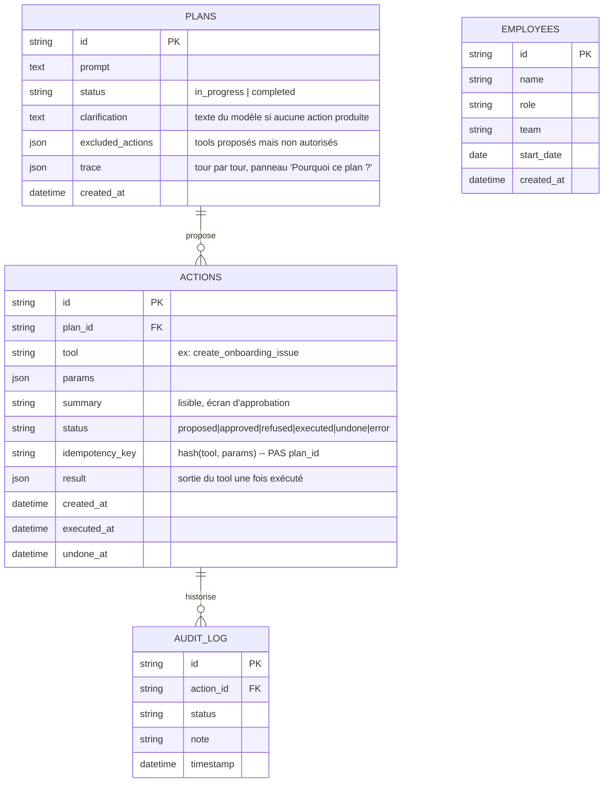

# Architecture

This document aims at providing more in-depth information on how (and why) the app was built.

## Data management

### Models: Plans, Actions, Employees, Audit log

Unlike a project built against an external system of record, this app owns all of its own business data — there is no external catalog to defer to. Everything lives in a single SQLite database (`onboarding.db`, under `DATA_DIR`), written to directly by **two different services** (`backend` and `mcp-server`), each through its own connection — see "Point de vigilance" below for what that implies.



`EMPLOYEES` has no foreign key to `PLANS`/`ACTIONS` on purpose: it is populated by the `create_employee_record` tool as a side effect, mirrored between the backend's SQLAlchemy model and mcp-server's own raw-SQL writes (see below) — it is not itself part of the plan/action workflow.

`Action.idempotency_key` is a pure function of `(tool, params)`, **deliberately excluding `plan_id`**: it is what lets `POST /plans/{id}/execute` recognize "this exact action was already executed under an earlier, regenerated plan" and skip dispatching it again, rather than re-sending a welcome e-mail or re-creating a GitHub issue every time a prompt gets re-planned. Including `plan_id` in the key was an earlier design that was corrected — it would have defeated the whole point, since every regenerated plan gets a fresh `id`.

Files generated by tools that produce one (`generate_handbook`, `create_calendar_event` — see `app.config.FILE_GENERATING_TOOLS`) are **not** stored in SQLite: they are written to disk under `DATA_DIR/documents/<plan_id>/` or `DATA_DIR/calendar/<plan_id>/`, and `Action.result` only holds the file's path. `GET /actions/{id}/download` validates that path stays under `DATA_DIR` before serving it (defense in depth against a manipulated/unexpected path).

### Setup: a fresh SQLite database, plus one versioned fixture

This project has no MariaDB-style init-seed mechanism, and needs none: the database is SQLite, and table creation goes through SQLAlchemy's `Base.metadata.create_all()` (`backend/app/database.py::init_db()`), called once from the backend's startup lifespan. It creates tables that don't exist yet and never touches ones that already do — no raw SQL files, no bind-mounted init folder, and (see "Point de vigilance" below) no migrations either.

mcp-server is a **separate process/container** from backend, so it cannot import `app.models.Employee` — instead, `mcp_server/tools/employee_db.py` mirrors the exact same `employees` table shape by hand, using the stdlib `sqlite3` module directly (`CREATE TABLE IF NOT EXISTS`, kept in sync with `models.py::Employee` manually). Whichever of the two services starts first creates the table; the other reuses it as-is. No fixed startup order is assumed between them.

The practical consequence: a first run starts genuinely empty — no employees, no plans, nothing to clean up before a demo. What *is* versioned with the code is a static JSON fixture, `mcp_server/tools/fixtures/employees_directory.json`, describing the company's **existing** staff by team (a manager + members, with real-looking names/e-mails/roles). It is used for two read-only purposes: resolving a `team` name into real recipient e-mail addresses for `send_welcome_message` (the LLM must never invent an address), and validating that a `team` name proposed in a plan actually exists (`list_teams` tool). This fixture is deliberately separate from the runtime `employees` table, which only ever holds the **new hires** being onboarded.

#### Pain/failure points

Two independent processes (`backend`, `mcp-server`) write to the exact same SQLite file concurrently, with no coordination between them beyond the file itself. Every connection opened by either service sets `PRAGMA journal_mode=WAL` and `PRAGMA busy_timeout=5000` — this absorbs lock contention (a writer waits up to 5s instead of failing immediately) rather than guaranteeing there can never be one; acceptable for the write volume this project produces, not necessarily for a much heavier one.

`create_all()` never migrates an existing table. Adding a column to an already-existing model (this happened during this project's own development — `Plan.trace`) does nothing to a database file that was created before that change: the app then fails at `db.commit()` with `sqlite3.OperationalError: table plans has no column named trace`, which today surfaces as a generic-looking (but fully logged) 500 from `create_plan()`. No migration tool (Alembic or similar) is wired up for v1. The practical workaround in dev is to delete `onboarding.db` and let `init_db()` recreate it from the current models — acceptable for a project at this stage, not a decision that would survive real production data.

## Docker

Why Docker? It is a widely popular engine for creating fully isolated environments ("containers") to run a specific service, while streamlining several important aspects of software management: restraining access for security, exposing services on a network for communication, making deployment reproducible, and abstracting away the host machine for portability.

### Services

- **ollama**: local LLM runtime, gated behind the `local-llm` Compose profile — it does **not** start with a plain `docker compose up`. It only starts (and only makes sense) when `LLM_MODEL_NAME` designates a local model (`ollama_chat/...` or `ollama/...`); `./start.sh` detects this and activates the profile plus pulls the model tag automatically.
- **mailhog**: fake SMTP server + web UI. The `send_welcome_message` tool sends real SMTP traffic here, never to a real mail provider — open the web UI to see what was actually "sent".
- **mcp-server**: FastMCP tool server exposing the actual onboarding actions as MCP tools, plus one read-only MCP resource (`config://allowed-tools`) describing which of them are currently executable. Served over MCP Streamable HTTP, not a plain REST API.
- **agent**: FastAPI service wrapping the planner (`planner.py`) — turns a prompt into a proposed multi-action plan through a multi-turn tool-calling loop, calling whichever LLM provider/model `LLM_MODEL_NAME` designates via [LiteLLM](https://docs.litellm.ai). Never invokes a tool with a real side effect itself — see [Décisions structurantes](#décisions-structurantes) below.
- **backend**: FastAPI REST API. Owns persistence (SQLite) and orchestrates the two points that require a human decision: plan approval, and — for cancellation — direct dispatch to mcp-server.
- **frontend**: Streamlit UI. Only ever talks to the backend, never directly to the agent or mcp-server.

### Source and network composition scheme

```text
                                     +-------------------------+
                                     |   Browser / End User    |
                                     +-------------------------+
                                                  |
                                     (Port 8501)  |
                                                  v
                                     +------------------------------------+
                                     |               frontend              |
                                     | Default Port: 8501:8501             |
                                     | Source: ./frontend/                 |
                                     +------------------------------------+
                                                  |
                                     (Port 8000)  |
                                                  v
                                     +------------------------------------+
                                     |               backend               |
                                     | Default Port: 8000:8000             |
                                     | Source: ./backend/                  |
                                     +------------------------------------+
                                        |                       |
                          (Port 8100)   |                       | (Port 8200, undo only --
                                        v                       |  see Décisions structurantes)
                          +------------------------+            |
                          |          agent          |            |
                          | Default Port: 8100:8100 |            |
                          | Source: ./agent/        |            |
                          +------------------------+            |
                              |                |                |
                (Port 8200)   |    (LiteLLM)   |                |
                              v                v                |
                +----------------------+  +----------------------+       |
                |      mcp-server      |  |     LLM provider     |       |
                | Default Port:        |  |  remote (Anthropic,  |       |
                | 8200:8200            |  |  OpenAI...) or local  |       |
                | Source: ./mcp_server/|  |  (ollama, gated by   |       |
                +----------------------+  |  the local-llm       |       |
                     |          |         |  profile)            |       |
        (Port 1025)  |          |         +----------------------+       |
                      v          |                                        |
        +----------------------+ |                                        |
        |       mailhog        | |                                        |
        | Default Port:        | |                                        |
        | 1025:1025, 8025:8025 | |                                        |
        +----------------------+ |                                        |
                                  v                                        v
                          +--------------------------------------------------+
                          |     data/ -- onboarding.db (SQLite, shared by     |
                          |     backend + mcp-server) + generated files       |
                          |     (documents/, calendar/)                       |
                          +--------------------------------------------------+
```

`mcp-server` also calls out to the **GitHub REST API** (`api.github.com`) from the `create_onboarding_issue`/`close_onboarding_issue` tools — not shown above to keep the diagram focused on the project's own services; it only fires when that specific tool actually runs, and only if `GITHUB_TOKEN`/`GITHUB_REPO` are configured (see `.env.example`).

## Networking

Each service has its host and container port independently configurable through `.env`. Both docker-compose.yml and the Python services themselves fall back to the same sensible default if a given key is missing, so the stack works out of the box with an unmodified `.env.example`.

| Service                          | Host port : container port (default) |
| :---                              | :---                                   |
| Frontend (Streamlit)              | 8501:8501                              |
| Backend (FastAPI)                 | 8000:8000                              |
| Agent (FastAPI + planner)         | 8100:8100                              |
| MCP server (FastMCP)              | 8200:8200                              |
| MailHog SMTP                      | 1025:1025                              |
| MailHog web UI                    | 8025:8025                              |
| Ollama (only if `local-llm` profile active) | 11434:11434                   |

- The **host** side (left of `host:container`) is what you reach from outside Docker Compose (e.g. `http://localhost:8501` in a browser) — configurable mainly to avoid colliding with something already running on your machine.
- The **container** side (right of `host:container`) is what the services use to reach each other over Docker's internal network (e.g. `http://backend:8000` from the frontend) — configurable if you'd rather harmonize every internal port to a single convention.

Services talking to each other always use the service **name** (`backend`, `agent`, `mcp-server`, `mailhog`), never `localhost` — Docker Compose's internal DNS resolves those names automatically inside the Compose network. `mcp-server`'s MCP endpoint specifically is reached at `{MCP_SERVER_URL}/mcp` (FastMCP's default mount path for the `streamable-http` transport).

## Architectural choices

Two decisions shape most of the request flows below and are referenced by name (`n°1`, `n°2`) throughout the codebase's own comments/docstrings, so they get a stable anchor here rather than being re-explained in five different files.

**n°1 — Planning never executes.** The agent only ever *proposes* a plan (`POST /plan`); the only two code paths that call an mcp-server tool with a real side effect are `agent/executor.py` (dispatch of **already human-approved** actions, reached exclusively from the backend after `POST /plans/{id}/execute`) and the direct undo path described in n°2 below — the planner itself (`planner.py::build_plan`) never does. This is reinforced twice, not once: `build_plan()` sorts the model's proposals into `actions`/`excluded_actions` against `allowed_names` (derived from the mcp-server resource `config://allowed-tools`, never from anything the model said), and `executor.py::execute_actions` re-checks that exact same list a second time before any real MCP call — so even a bug that let a disallowed tool leak into `actions` would still be blocked at execution time. See `agent/tests/test_planner.py::test_build_plan_blocks_disallowed_tool_even_if_the_model_is_tricked`.

**n°2 — Cancellation bypasses the agent entirely.** `POST /actions/{id}/undo` has the backend call mcp-server **directly** (`backend/app/services/mcp_client.py`), with no re-planning through the agent and therefore no new LLM call. Compensating an already-executed action is a deterministic operation — call the matching compensation tool (`close_onboarding_issue`, `delete_employee_record`, ...) with the stored result as its single argument — not a new decision that needs a model's judgment. See [Sequence diagrams — Cancelling an action](#3-cancelling-an-action-undo) below.

Both decisions rest on the same underlying principle already stated in `README.md`'s "Core design principles": **no tool with a real-world side effect ever runs without a prior, explicit human approval of the plan action that contains it.** A prompt injection, an over-eager model, or a bug upstream can at worst get a tool call *proposed* — never executed.

## Sequence diagrams

Four flows cover every interaction this app supports; each corresponds to one or more backend endpoints.

### 1. Generating a plan

<details>
<summary>Prompt in, proposed actions out — no side effect anywhere in this flow</summary>

```
+-----------+        +-----------+        +-----------+        +-------------+        +--------------+
| Frontend  |        | Backend   |        | Agent     |        | MCP Server  |        | LLM Provider |
| (8501)    |        | (8000)    |        | (8100)    |        | (8200)      |        | (via LiteLLM)|
+-----------+        +-----------+        +-----------+        +-------------+        +--------------+
      |                    |                    |                     |                       |
      | 1. POST /plans     |                    |                     |                       |
      |   {prompt}         |                    |                     |                       |
      |------------------->|                    |                     |                       |
      |                    | 2. POST /plan      |                     |                       |
      |                    |   {prompt}         |                     |                       |
      |                    |------------------->|                     |                       |
      |                    |                    | 3. Pré-plan guards  |                       |
      |                    |                    |    (regex, emoji,   |                       |
      |                    |                    |    classifieur LLM) |                       |
      |                    |                    |-----------------+   |                       |
      |                    |                    |                 |   |                       |
      |                    |                    |<----------------+   |                       |
      |                    |                    |  (si bloqué : saute directement à l'étape 8, |
      |                    |                    |   trace kind="blocked", aucun appel MCP/LLM) |
      |                    |                    |                     |                       |
      |                    |                    | 4. list_tools() +   |                       |
      |                    |                    |    read_resource(   |                       |
      |                    |                    |    "config://       |                       |
      |                    |                    |    allowed-tools")  |                       |
      |                    |                    |-------------------->|                       |
      |                    |                    |<--------------------|                       |
      |                    |                    |                     |                       |
      |                    |                    | 5. Boucle tool-calling (jusqu'à MAX_TURNS)   |
      |                    |                    |------------------------------------------->  |
      |                    |                    |<-------------------------------------------  |
      |                    |                    |                     |                       |
      |                    |                    | 6. call_tool(       |                       |
      |                    |                    |    "list_teams")    |                       |
      |                    |                    |    -- vérif équipe  |                       |
      |                    |                    |    déterministe,    |                       |
      |                    |                    |    PAS via le LLM   |                       |
      |                    |                    |-------------------->|                       |
      |                    |                    |<--------------------|                       |
      |                    |                    |                     |                       |
      |                    | 7. {actions,       |                     |                       |
      |                    |    excluded_actions|                     |                       |
      |                    |    clarification,  |                     |                       |
      |                    |    trace}          |                     |                       |
      |                    |<-------------------|                     |                       |
      |                    | 8. Persist Plan +  |                     |                       |
      |                    |    Actions         |                     |                       |
      |                    |    (status=        |                     |                       |
      |                    |    proposed) +     |                     |                       |
      |                    |    audit log       |                     |                       |
      |                    |-----------------+  |                     |                       |
      |                    |                 |  |                     |                       |
      |                    |<----------------+  |                     |                       |
      | 9. 201 Created     |                    |                     |                       |
      |    PlanRead        |                    |                     |                       |
      |<-------------------|                    |                     |                       |
      | 10. Render checklist + "Pourquoi ce      |                     |                       |
      |     plan ?" trace panel                  |                     |                       |
      |-----------------+  |                    |                     |                       |
      |                 |  |                    |                     |                       |
      |<----------------+  |                    |                     |                       |
```

</details>

### 2. Approving and executing a plan

<details>
<summary>Human decision, then mechanical dispatch of only what was approved</summary>

```
+-----------+        +-----------+        +-----------+        +-------------+       +------------------+
| Frontend  |        | Backend   |        | Agent     |        | MCP Server  |       | MailHog / GitHub |
| (8501)    |        | (8000)    |        | (8100)    |        | (8200)      |       | / SQLite / data/ |
+-----------+        +-----------+        +-----------+        +-------------+       +------------------+
      |                    |                    |                     |                       |
      | 1. PATCH /actions/{id}                  |                     |                       |
      |    {status: approved|refused}           |                     |                       |
      |    (une fois par action)                |                     |                       |
      |------------------->|                    |                     |                       |
      |                    | 2. Action.status = |                     |                       |
      |                    |    body.status +   |                     |                       |
      |                    |    audit log       |                     |                       |
      |                    |-----------------+  |                     |                       |
      |                    |                 |  |                     |                       |
      |                    |<----------------+  |                     |                       |
      |<-------------------|                    |                     |                       |
      |                    |                    |                     |                       |
      | 3. POST /plans/{id}/execute             |                     |                       |
      |------------------->|                    |                     |                       |
      |                    | 4. Pour chaque action approuvée :        |                       |
      |                    |    idempotency_key déjà EXECUTED sous    |                       |
      |                    |    un plan précédent ? -> réutilise le   |                       |
      |                    |    résultat, ne redispatch PAS.          |                       |
      |                    |-----------------+  |                     |                       |
      |                    |                 |  |                     |                       |
      |                    |<----------------+  |                     |                       |
      |                    |                    |                     |                       |
      |                    | 5. POST /execute   |                     |                       |
      |                    |   {actions restantes -- plan_id injecté  |                       |
      |                    |    par le backend pour les tools qui     |                       |
      |                    |    génèrent un fichier}                  |                       |
      |                    |------------------->|                     |                       |
      |                    |                    | 6. Re-vérifie       |                       |
      |                    |                    |    allowed_names    |                       |
      |                    |                    |    (défense en      |                       |
      |                    |                    |    profondeur)      |                       |
      |                    |                    |-----------------+   |                       |
      |                    |                    |                 |   |                       |
      |                    |                    |<----------------+   |                       |
      |                    |                    | 7. call_tool(tool, params) pour chaque       |
      |                    |                    |    action -- effet de bord RÉEL              |
      |                    |                    |-------------------->|                       |
      |                    |                    |                     | 8. e-mail / issue     |
      |                    |                    |                     |    GitHub / ligne     |
      |                    |                    |                     |    SQLite / fichier   |
      |                    |                    |                     |    généré             |
      |                    |                    |                     |---------------------->|
      |                    |                    |                     |<----------------------|
      |                    |                    |<--------------------|                       |
      |                    | 9. [{action_id,    |                     |                       |
      |                    |    status, result, |                     |                       |
      |                    |    note}]          |                     |                       |
      |                    |<-------------------|                     |                       |
      |                    | 10. Action.status = executed|error,      |                       |
      |                    |     result stocké, audit log             |                       |
      |                    |-----------------+  |                     |                       |
      |                    |                 |  |                     |                       |
      |                    |<----------------+  |                     |                       |
      | 11. [ExecuteResult]|                    |                     |                       |
      |<-------------------|                    |                     |                       |
      | 12. Statut final par action +           |                     |                       |
      |     lien de téléchargement si fichier   |                     |                       |
      |-----------------+  |                    |                     |                       |
      |                 |  |                    |                     |                       |
      |<----------------+  |                    |                     |                       |
```

</details>

### 3. Cancelling an action (undo)

<details>
<summary>Bypasses the agent entirely -- see "Décisions structurantes n°2"</summary>

```
+-----------+                    +-----------+                    +-------------+
| Frontend  |                    | Backend   |                    | MCP Server  |
| (8501)    |                    | (8000)    |                    | (8200)      |
+-----------+                    +-----------+                    +-------------+
      |                                |                                  |
      | 1. POST /actions/{id}/undo     |                                  |
      |------------------------------->|                                  |
      |                                | 2. Guard: action.status ==       |
      |                                |    "executed" (sinon 409)        |
      |                                |-----------------+                |
      |                                |                 |                |
      |                                |<----------------+                |
      |                                | 3. Cherche le tool de            |
      |                                |    compensation associé à        |
      |                                |    action.tool (mapping fixe,    |
      |                                |    voir tableau ci-dessous)      |
      |                                |-----------------+                |
      |                                |                 |                |
      |                                |<----------------+                |
      |                                | 4. call_tool(compensation_tool,  |
      |                                |    {ref: action.result})         |
      |                                |    -- direct, AUCUN passage      |
      |                                |    par l'agent, aucun appel LLM  |
      |                                |---------------------------------->|
      |                                |                                  | 5. Ferme le ticket
      |                                |                                  |    GitHub / supprime
      |                                |                                  |    la ligne employé
      |                                |                                  |-----------------+
      |                                |                                  |                 |
      |                                |                                  |<----------------+
      |                                |<----------------------------------|
      |                                | 6. Action.status = "undone",     |
      |                                |    audit log                     |
      |                                |-----------------+                |
      |                                |                 |                |
      |                                |<----------------+                |
      | 7. UndoResult                  |                                  |
      |<--------------------------------|                                  |
```

</details>

Compensation coverage today (`backend/app/services/mcp_client.py::_UNDO_SPEC_BY_ACTION_TOOL`) — a tool missing from this table raises an explicit "not implemented yet" error (surfaced as HTTP 502) rather than silently marking the action `undone` without having actually compensated anything:

| Action tool                 | Compensation tool         | Implemented? |
| :---                        | :---                       | :---           |
| `create_onboarding_issue`   | `close_onboarding_issue`   | Yes            |
| `create_employee_record`    | `delete_employee_record`   | Yes            |
| `send_welcome_message`      | —                           | No (an e-mail can't be recalled) |
| `generate_handbook`         | —                           | No             |
| `create_calendar_event`     | —                           | No             |

### 4. Downloading a generated file

<details>
<summary>Why the frontend proxies the bytes instead of linking straight to the backend</summary>

`generate_handbook` and `create_calendar_event` write a file to disk and store its path in `Action.result`. The backend's `BACKEND_URL` only resolves **inside** the Docker Compose network — the end user's browser, which only ever reaches the `frontend` container's exposed port, cannot follow a direct link to `http://backend:8000/...`. The frontend (a server-side Streamlit process, itself inside the Docker network) therefore fetches the bytes from the backend itself and hands them to the browser through its own response.

```
+-----------+                    +-----------+
| Browser   |                    | Frontend  |                    +-----------+
+-----------+                    | (8501)    |                    | Backend   |
      |                          +-----------+                    | (8000)    |
      | 1. Clique "Télécharger"       |                            +-----------+
      |------------------------------>|                                  |
      |                                | 2. GET /actions/{id}/download   |
      |                                |    (appel serveur à serveur,    |
      |                                |    interne au réseau Docker)    |
      |                                |--------------------------------->|
      |                                |                                  | 3. Valide : tool
      |                                |                                  |    file-generating,
      |                                |                                  |    status=executed,
      |                                |                                  |    chemin sous DATA_DIR
      |                                |                                  |-----------------+
      |                                |                                  |                 |
      |                                |                                  |<----------------+
      |                                | 4. FileResponse (bytes, filename, media_type)       |
      |                                |<---------------------------------|
      | 5. st.download_button          |                                  |
      |    (bytes déjà en mémoire)      |                                  |
      |<-------------------------------|                                  |
```

</details>

### Python components's dependencies

Hereunder is the shortlist of Python libraries actually used by each custom component, read directly from each `requirements.txt`. This project's `requirements.txt` files are hand-maintained (no `pip-compile`/`requirements.in` split) — each one is both the "core libraries" list and the exact set installed.

#### Python libraries <-> Docker services mapping

| Library name  | Short description                                                    | App component(s) (Docker service name) |
| -------------- | --------------------------------------------------------------------- | ---------------------------------------- |
| fastapi        | Engine to define and expose HTTP APIs                                 | agent, backend                           |
| uvicorn        | HTTP server able to manage asynchronous apps                          | agent, backend                           |
| httpx          | Async HTTP client                                                     | agent, backend, mcp-server                |
| fastmcp        | Client AND server implementation of the Model Context Protocol         | agent, backend, mcp-server                |
| litellm        | Provider-agnostic LLM calls (Anthropic, OpenAI, Ollama, NVIDIA NIM, Gemini, Bedrock, Azure, ...) behind a single interface | agent |
| sqlalchemy     | ORM engine to abstract Python <-> database interactions                | backend                                  |
| pydantic       | Framework to define reliable, validated tool/API schemas               | backend, mcp-server                       |
| jinja2         | Template engine used to render the welcome-pack HTML document          | mcp-server                                |
| streamlit      | Web UI framework                                                       | frontend                                  |
| requests       | Synchronous HTTP client (frontend -> backend calls)                    | frontend                                  |

Two dependencies are listed in `mcp_server/requirements.txt` but are **not actually imported anywhere in mcp-server's code** as of this writing — `weasyprint` (the module docstring of `tools/documents.py` explicitly documents choosing an HTML-only fallback over a WeasyPrint-based PDF conversion, for reliability/dependency-footprint reasons) and `icalendar` (`tools/event_calendar.py`'s `.ics` file is built by hand, "sans dépendance externe", per its own module docstring). `SQLAlchemy` is also listed there, but mcp-server's `employee_db.py` deliberately talks to the shared SQLite file through the stdlib `sqlite3` module instead (it cannot import the backend's SQLAlchemy model, being a separate process). None of these three is a bug — the code that would have used them was deliberately simplified — but they are candidates for removal from `mcp_server/requirements.txt` if they stay unused.

#### Docker services <-> folder mapping

| Docker service | Component's source directory |
| --------------- | ------------------------------ |
| frontend         | `./frontend`                    |
| backend          | `./backend`                     |
| agent            | `./agent`                       |
| mcp-server       | `./mcp_server`                  |
